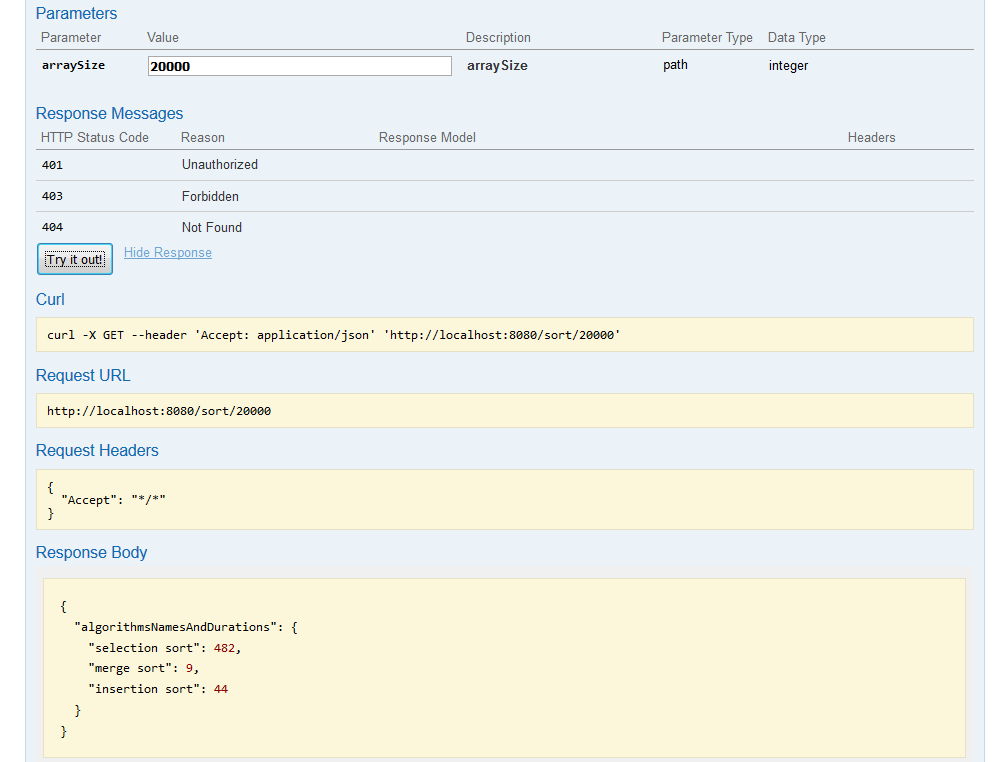

# Algorithms comparison
During learning basic sort algorithms I came up with an idea to collect implementations in a simple project. Application
generates array with specified size and sorts it using different algorithms. User get response 
which algorithm is the fastest one!
This is just the beginning of this project. I'm not sure yet what idea would come up to my mind next.  

#### Build and run Java application (localhost:8080)

```sh
$ mvn clean install
```
```sh
$ java -jar  target/algorithms_comparison-0.0.1-SNAPSHOT.jar
```
<br></br>
#####More information in swagger (localhost:8080/swagger-ui.html):

